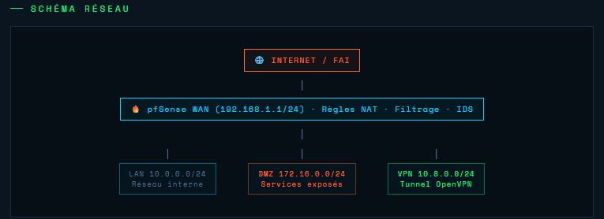

# Hardening Debian - Normes ANSSI 
Projet de sécurisation et d'automatisation d'un serveur Debian 11/12, réalisé dans le cadre de mes travaux sur la cybersécurité et l'administration système.

## Description
Ce dépôt contient un script Bash (`hardening.sh`) conçu pour appliquer les recommandations de sécurité de l'ANSSI (R32/R33). Ce type de configuration a été utilisé pour garantir la conformité des serveurs lors de mes expériences en **collectivité (Mairie)** et en **secteur hospitalier (HDS)**.

## Fonctionnalités du script
* **Gestion des services :** Désactivation automatique des services non essentiels (Avahi, CUPS, Bluetooth, etc.).
* **Firewalling :** Configuration d'un pare-feu `iptables` avec une politique par défaut "DROP" (tout interdire sauf le nécessaire).
* **Sécurisation SSH :** - Interdiction de la connexion en `root`.
  - Désactivation de l'authentification par mot de passe (priorité aux clés SSH).
  - Restriction de l'accès SSH aux réseaux d'administration/VPN.
* **VPN :** Configuration pour autoriser uniquement les flux via OpenVPN (port 1194).

## Technologies utilisées
* **OS :** Debian / Ubuntu
* **Sécurité :** Iptables, SSH Hardening
* **Scripting :** Bash

---
